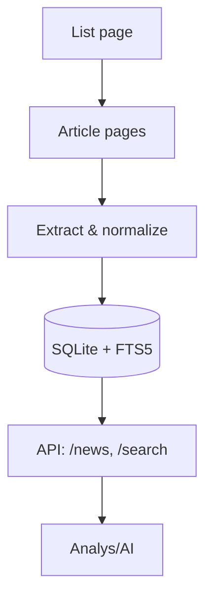

# Kommunnyheter – end-to-end-flöde (Uppsala kommun)

## Problem & målbild
Hämta nyheter från Uppsala kommuns webbplats, normalisera fält och lagra sökbart för enkel åtkomst av analys/AI. Återkommande körning och enkel vidareutveckling.

## Flöde i korthet
- Insamling: Hämtar nyhetslista (HTML) och följer artikellänkar.
- Databehandling: Extraherar titel, datum, ingress, brödtext; normaliserar datum; rensar till text.
- Lagring: SQLite med FTS5 (fulltextsök) + triggers för synk.
- Tillgängliggörande: FastAPI med /news, /search och /ingest.

## Val & motivering
- Stack: Python + FastAPI, httpx + BeautifulSoup – snabbt, beprövat för scraping/API.
- DB: SQLite + FTS5 – enkel fil, bra sök; kan bytas till Postgres/pgvector vid behov.
- Metodik: HTML-scraping (RSS saknas ofta) med selektor-fallbacks och idempotent upsert (URL-hash).

## Datamodell
- `news(id, title, summary, body_text, published_at, source_url, municipality, created_at, updated_at, raw_html)`
- `news_fts(title, summary, body_text)` + triggers => fulltextsök.

## Kör-/testinstruktioner (Windows)
1) Installera Python 3.11+ från `https://www.python.org/downloads/` och kryssa i "Add Python to PATH".
2) I PowerShell, kör:
python -m venv .venv
.\.venv\Scripts\Activate.ps1
pip install -r requirements.txt
python -m app.ingest --limit 20
uvicorn app.api:app --reload

- Lista: `http://127.0.0.1:8000/news`
- Sök: `http://127.0.0.1:8000/search?q=skola`
- Trigga import: `POST http://127.0.0.1:8000/ingest`

## Reflektion & nästa steg
- Steg till slutresultat:
  1. Initiera SQLite och FTS5-schema (triggers för synk).
  2. Hitta fungerande nyhetslista via kandidat-URL:er.
  3. Hämta listsida med realistiska headers (User-Agent, språk).
  4. Extrahera artikellänkar med selektorer och fallback till alla <a>.
  5. Hämta varje artikel och parsa titel, datum, ingress, brödtext.
  6. Normalisera datum och rensa HTML → ren text.
  7. Skapa ID som hash av URL; upsert till SQLite (idempotent).
  8. Låt FTS-triggers uppdatera sökindex automatiskt.
  9. Exponera via FastAPI: /news, /search, /ingest.
- Lärdomar: Kommunwebbar saknar ibland RSS och ändrar strukturer. Jag lade till sökvägsfynd (flera kandidat-URLs), realistiska headers och bredare länkurval för att undvika välkomst-/cookiesidor och fånga artiklar robustare.
- Skalning: Byt till Postgres + pgbouncer; lägg till pgvector för semantisk sök/Q&A; parallellisera hämtning och införa backoff/caching/roterande IP-strategi vid blockering.
- Datakvalitet: Förbättra svensk datumtolkning, rensa boilerplate, språktaggning och ev. auto-sammanfattning vid import.

## AI-stöd
AI användes för scaffold av projekt, API/DB/scraper-boilerplate och README-utkast; manuellt justerat för FTS-rankning och robust list-URL.